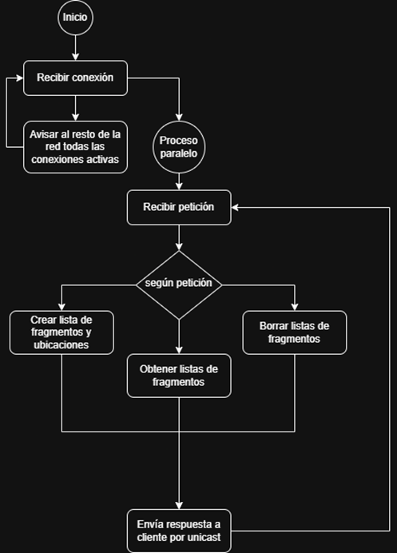
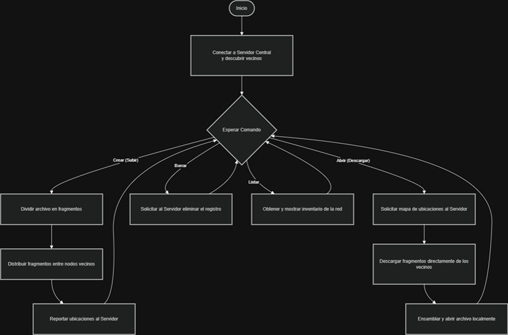
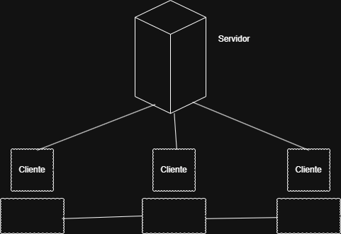

## Introducción
Con el objetivo de implementar arquitecturas paralelas en redes se crea un sistema de guardado de archivos distribuido con un servidor y conexión para múltiplescomputadoras. Cada computadora debe tener una partición de los archivos y recuperarlos a través de mensajes dentro de una red.
El proyecto busca hacer que el servidor funcione como un “monitor” que conoce la ubicación de cada fragmento del archivo y organiza las operaciones que se pueden realizar en la red; específicamente, subir, descargar y eliminar archivos. Mientras que el servido está activo, los clientes están en constante comunicación para informarle al servidor su intención de realizar una operación y esperando que se les den instrucciones de mandar fragmentos entre ellas.
Se implementó una arquitectura cliente-servidor sobre la cual se buscó aplicar los mecanismos de sincronización y exclusión mutua para garantizar el correcto funcionamiento del sistema. Asimismo, se utilizaron redes broadcast para construir una bitácora constante entre los actores del sistema, así como, conexiones unicast para la realización de peticiones y recuperación de la información. 

## Análisis
La característica principal que se nota al revisar el problema es la necesidad de fragmentar archivos y distribuirlos entre diferentes nodos. Se decidió crear fragmentos de un tamaño arbitrario para mandar a través de la red que son distribuidos entre diferentes computadoras.
Para la parte de reconstrucción de un archivo fragmentado, había dos vertientes: el servidor podía solicitar por broadcast los fragmentos, recuperar la información y mandarla al cliente solicitante o, el servidor podía solicitar que se mandaran los fragmentos al solicitante y, el solicitante podría reconstruir la información recibiendo el orden de los fragmentos. Se optó por mantener la segunda opción pues, en principio, es óptimo el evitar la triangulación al enviar los fragmentos al servidor solo para ser reconstruido. De esta manera, intuimos que la red debía ser una topología de malla totalmente conexa.
El siguiente aspecto por considerar eran las comunicaciones. El servidor debía mantener registro de las operaciones para conocer el estado de los archivos. Más aún, debía ser capaz de compartir con los clientes parte de este registro para mantener su sistema actualizado. Para resolver este requerimiento, usamos comunicaciones por broadcast del servidor al cliente.  Por otro lado, la comunicación del cliente al servidor debía ser unicast debido a que el resto de los usuarios de la red no tendrían por qué enterarse de las operaciones realizadas ajenas a ellos mismos. 
Además de la comunicación entre el cliente y el servidor, el siguiente elemento a resolver fue la comunicación entre clientes. Al ser un sistema de archivos distribuidos, el problema principal recae en la localización de los recursos (fragmentos de archivo) y la identificación de nodos activos sin saturar el servidor central con la transferencia de datos pesados.
Para resolver el problema de cómo un cliente conoce a otros miembros de la red, se utilizó el método comunicación en broadcast del servidor a los clientes. El servidor anuncia la llegada de nuevos clientes a toda la subred, y cada cliente mantiene una lista dinámica de vecinos.
Como se mencionó previamente, el servidor actúa como un monitor que mantiene un registro de las ubicaciones de los fragmentos en cada cliente. El servidor no maneja y distribuye los archivos manualmente, en vez de eso, dirige las operaciones que cada cliente va a realizar para distribuir los fragmentos. El cliente no envía el archivo al servidor, en su lugar le notifica qué fragmentos posee tras distribuirlos entre sus pares.
La conexión entre clientes se maneja con un modo de conexión unicast en TCP. Esto evita, la triangulación de datos a través del servidor, optimizando el ancho de banda de la red.
Finalmente, nótese que el servidor debería ser capaz de procesar las peticiones de los clientes simultáneamente, a la vez que, los clientes deben ser capaces de enviar múltiples fragmentos mientras que hacen sus propias solicitudes En consecuencia, se aplicó programación en paralelo que nos permita crear procesos ligeros para cumplir con cada una de las tareas al mismo tiempo, mismos que se detallaran en la sección de diseño del algoritmo.

## Diseño del algoritmo
El algoritmo está dividido en 2 partes, los clientes y los servidores.
El servidor tiene un algoritmo que está escuchando conexiones constantemente y resolviendo las peticiones de manera asíncrona. Las instrucciones se pueden ver en el siguiente diagrama:

En resumen, cada que un cliente se conecta, el servidor crea un proceso ligero en paralelo que está atento a recibir peticiones. Cada petición, tiene un código que permite identificarla seguida de una cadena de argumentos. Con base en el identificador, el servidor crea la lista de fragmentos, la recupera o la borra y envía al cliente una respuesta que puede contener un error o puede contener un mensaje de éxito.
Al cerrarse la conexión, se cierra este proceso en paralelo. Además, las listas de fragmentos que requieran del nodo desconectado enviarán error por no poder enviar los fragmentos.
El siguiente diagrama describe el algoritmo desde la lógica del cliente:

El cliente establece conexión con el servidor central y activa la escucha de mensajes en broadcast para descubrir otros nodos vecinos en la red.
Para subir un archivo, este se divide en fragmentos que se distribuyen por TCP entre los vecinos; finalmente, se informa al servidor central sobre la ubicación de cada pedazo.
Cuando un cliente abre y descarga un archivo solicita al servidor un mapa de ubicaciones, descarga los fragmentos directamente de los nodos poseedores y utiliza el Gestor de Fragmentos para reconstruir el archivo original.
Permite solicitar el inventario global de archivos disponibles en la red o dar de baja registros mediante comandos directos al servidor central.

## Topología
Para la implementación se consideró la siguiente topología de red donde todos los nodos están interconectados entre sí y conectados a un servidor. 

## Gestión de recursos
Durante el desarrollo final del proyecto, se implementaron soluciones avanzadas para superar las limitaciones iniciales de puertos y almacenamiento:
Originalmente, los protocolos de red bloqueaban el uso de múltiples clientes en la misma computadora por colisiones en los puertos de escucha. Se resolvió implementando la reutilización de puertos UDP para que varios clientes locales escuchen el mismo canal de broadcast, y se asignaron puertos TCP independientes para la clase ServidorP2P de cada instancia. Esto permite abrir varios clientes en una misma PC, los cuales pueden enviar y recibir archivos entre ellos mismos y hacia computadoras externas, operando como nodos lógicos completamente independientes.
Al tener múltiples clientes en una sola PC, el sistema es capaz de aislar las desconexiones. Si un cliente local se cierra abruptamente, el servidor actualiza su inventario y elimina únicamente la ruta (IP:Puerto) de ese cliente específico. Los demás clientes ejecutándose en la misma PC permanecen intactos y la red puede seguir operando. Gracias a esto, tanto una PC externa como las instancias locales restantes pueden seguir pidiendo archivos sin intentar conectarse al nodo desconectado, evitando bloqueos en la transferencia.
También se optimizó la gestión de almacenamiento. Al ejecutar la operación de "Eliminar", la orden no solo borra el registro lógico en la TablaDocs del servidor central, sino que el servidor emite una directiva hacia los clientes poseedores para que busquen en su directorio oculto (carpeta de fragmentos) y eliminen físicamente los archivos .frag asociados a ese documento, liberando espacio real en el disco duro de los usuarios.

## Alcance y limitaciones
El sistema puede:
- Ejecutar múltiples clientes lógicos de manera simultánea dentro de una misma computadora, permitiendo transferencias P2P en localhost.
- Detectar cambios de red
- Fragmentar y compartir archivos de al menos 250 MB
- Conectar tantos clientes como soporte el hardware del servidor
- Realizar comunicaciones broadcast y unicast entre clientes y servidor
- Realizar comunicaciones unicast entre clientes
- Reconstruir un archivo fragmentado solo si todos los nodos están conectados
- Liberar almacenamiento local mediante el borrado físico de fragmentos distribuidos.
- Operaciones para subir, descargar y eliminar archivos

Limitaciones Actuales: 
- Limitado a redes LAN’s 
- Dependencia de las PC’s conectadas al servidor para recuperar archivos.
- Se permite borrar un archivo de la red incluso cuando un cliente poseedor de fragmentos está desconectado, sin embargo, dicho cliente conservará sus fragmentos del archivo y tendrán que ser borrados manualmente.

## Créditos
- [Daniel Rosas](https://github.com/DIRM2705)
- [Alan Ortiz](https://github.com/Okioh)
- [Bruno Manriquez](https://github.com/acidlion)